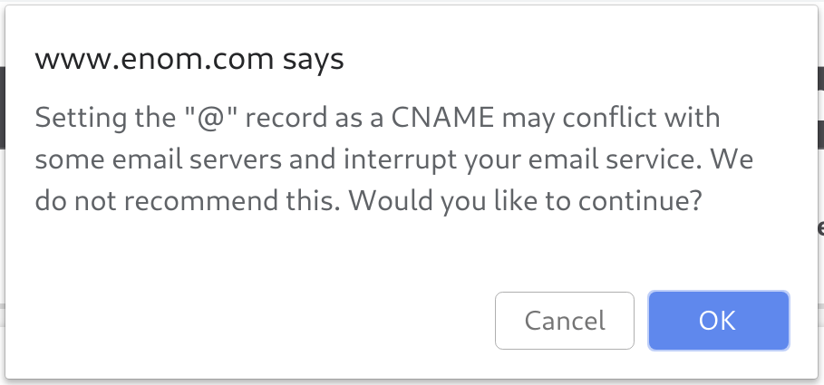

# Enom at a glance

 |   | Does | Doesn't |
 | :---: | :---: | :---: |
 | Apex `CNAME` equivalent |  | :no_entry_sign: |
 | API Access | :heavy_check_mark:| |

[In the past, Enom has indicated that they supported apex domain `CNAME` records with an alias feature.](https://www.enom.com/blog/our-new-dns-under-the-hood/). However, at the time this Fly documentation was written, Enon had no public documentation that supported their older blog post. For example, [documentation for DNS records at Enom](https://www.enom.com/help/faq_hostrecords.aspx) suggests that apex domain `CNAME` records are no longer supported:

> **Restrictions**
>
> * A CNAME must have no other records of other types (MX, A, etc). This is very important especially with the @ record. If you specify a CNAME record type for the @ hostname, then email will not route properly for this domain name.

Wether using Enom's free or premium DNS service, you are warned when attempting to create a `CNAME` record at the apex:

Direct communication between Fly and Enom's support channels, however, have stated that apex domain `CNAME` records will be implemented as an `ALIAS` record, but that current documentation and UI warnings are perhaps not worded in the best way to reflect this.

Due to the uncertainty, Fly wouldn't recommend using Enom for apex domain `CNAME` / `ALIAS` records. If you do choose to use Enom, contact us and let us know what your experience is.

# Using a Subdomain

If you want your application to be accessed via a subdomain on your main domain, you'll want to create a new `CNAME` record within Enom's DNS management control panel.

1. Log in to your Enom account and look for the domain that you want to use with a Fly Edge Application. If Enom is the service being used to host your DNS zone, you'll find the domain under the "DNS hosted" link:

2. On the DNS Hosting page, click the "New Row" button and create a `CNAME` record.

  * The "Host Name" would be the subdomain that you want your users to access your application with. For example, `app` would mean your users access your site with the URL `app.your-application.com`.
  * The "Record Type" drop down menu needs to be `CNAME`
  * The "Address" section would be where your application resides at Fly. For example, `vapid-hedgehog-4710.edgeapp.net`.

Once you save the `CNAME` information, your users will be able to access your application at Fly.io using the subdomain you just set up. Your users will only see your subdomain in their browser, and will not see your Fly.io URL.
